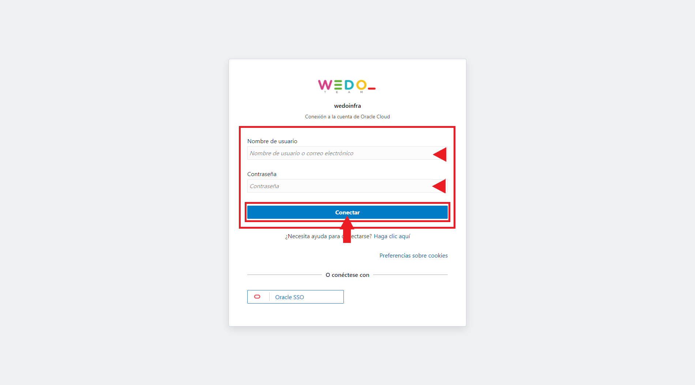
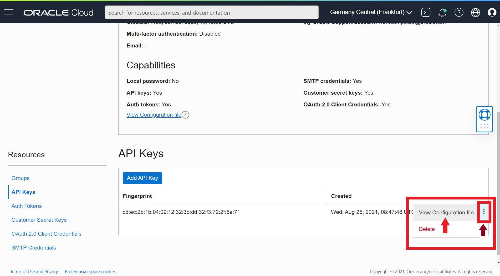
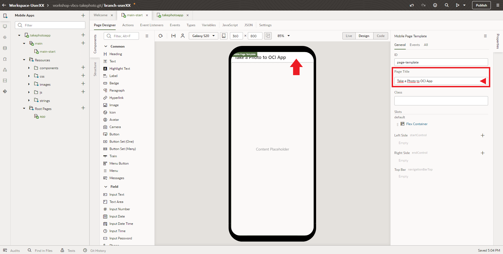
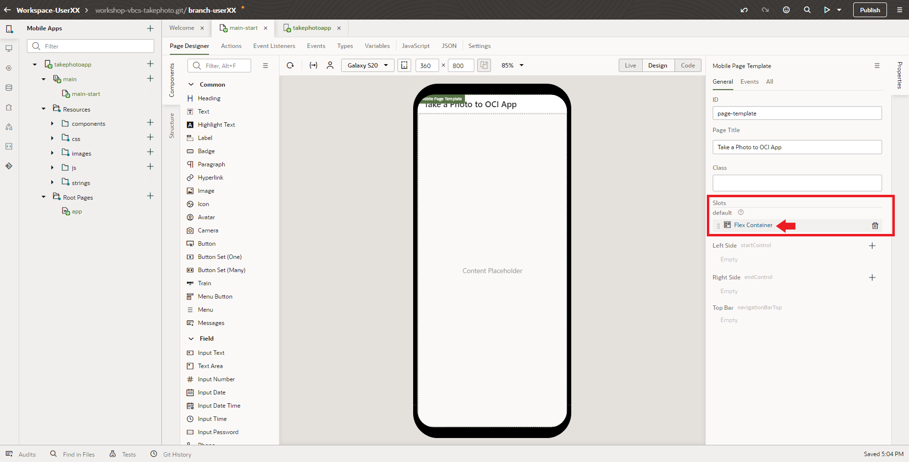
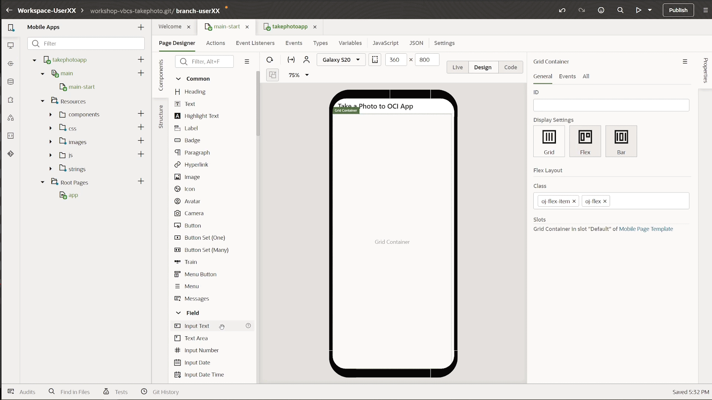
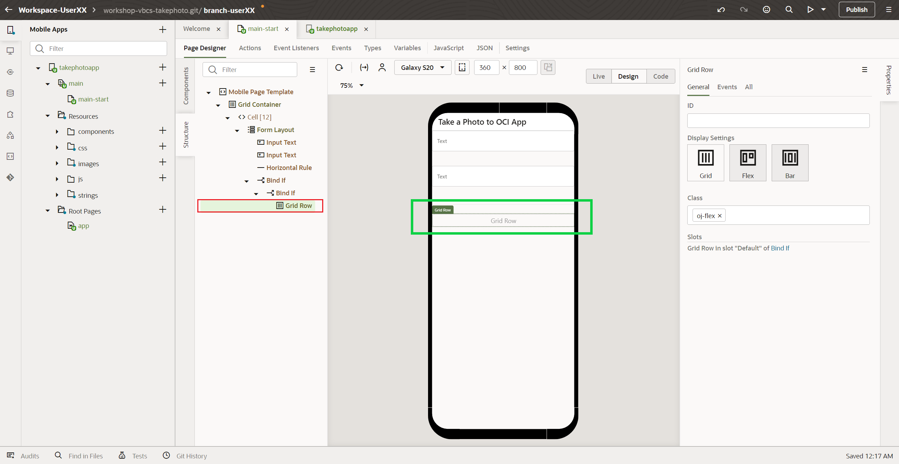
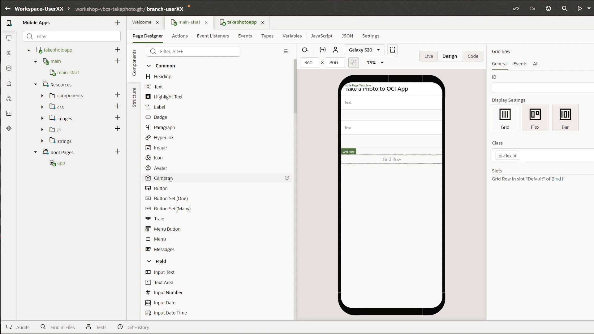
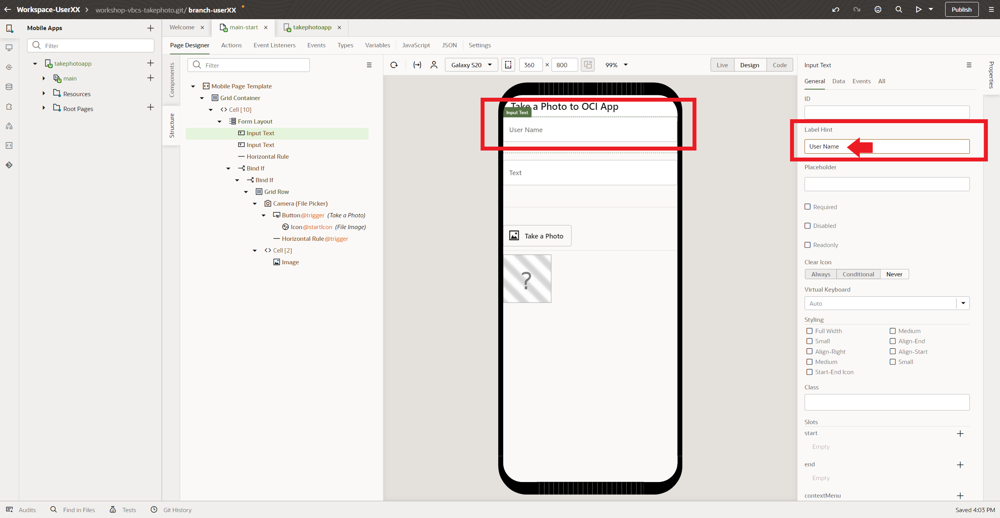
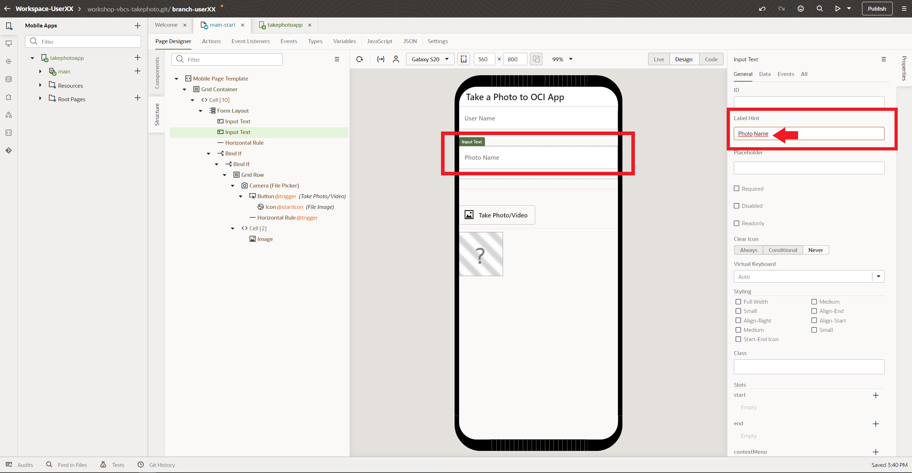

# Visual Builder workshop.
This workshop will teach you how to create a new Oracle Visual Builder mobile application, that will allow you to take a photo with the mobile camera and upload it to Oracle Cloud (OCI) Object Storage.

  
1.- Creating the OCI API Key. (click to show)

---
You will have to connect the Visual Builder app to OCI Object Storage Bucket to Store the mobile photos or image files in a bucket. You must create an OCI API Key to get access to the OCI Services via API REST. So let's create the API Key.
  
---
  
## Creating the API Key
First Sign in [OCI web console](https://cloud.oracle.com) with your credentials 
> Note: this credentials will be provided to you in the workshop by the trainers, or you can use youw own credentials if you have a trial or paid tenancy.

Write your tenancy name and click **Next** Button.

Then click Continue leaving the Identity Providers as *oracleidentitycloudservice*

Next write you *User Name* and *Password* and click in **Connect** Button to access to OCI web console.

Then click in the **Profile icon** at the top right of the console to access to the user **Settings**.

Scroll down and click **API Keys** in the *Resources menu*

Next click **Add API Key** button to add a new API Key.

Select **Generate API Key Pair**. 
> Note: you could use your own public and private keys in pem format, but in this workshop and for academical purposes we'll use the auto generathed keys.

Next you must to download the *Private* and *Public* Keys to your laptop/desktop.

After that, you might have two **.pem** files one mark as public.

Then click in **Add** button.

Next window is the summary or **Configuration File Preview**. Click in the **copy** link to copy your OCI API credentials to a text file in you local computer as you will need them in future steps in the workshop. Then click **Close** Button to finish the process.

You might have a new API key created and you should see the Fingerprint key in the OCI web console. 

You can get the Config file that you copied before clicking in the *tree vertical* dots in the Fingerprint row and select **View Config File**.

  
2.- Acessing Visual Builder Studio and WorkSpace using Visual Builder Cloud Service (click to show)

  
---
  To develop your Visual Builder Application you must access to the workshop Visual Builder Studio instance. Visual Builder is not only used to develop Visual Builder applications, but it allows the development of any kind of modern application thanks to its multitude of integrated development tools, such as a GIT repository, CI/CD pipelines engine, artifact generation, container repository, agile tools, team building tools like wiki and snipples and more. If you want to know more please click [here](https://www.oracle.com/application-development/visual-builder-studio/)
 
---
  
## Acessing Visual Builder Studio and WorkSpace using Visual Builder Cloud Service
To get access to Visual Builder Studio (VBS) you have to Sign-in Oracle Cloud web console with your tenancy user credentials. Then Click in the *hamburguer icon* in the top left part of the web console and select **OCI Classic Services** then click in **Developer** to access to Visual Builder Studio instance.

  
Next you have to click in the VBS instance **menu icon** and click in the **Access Service Instance**
  
  
 
Then in **Organization**, select the *Project* -> **Workshop-VBCS-Takephoto** that you will use for this workshop. 
  

  
Select *Workspaces* in the left menu to get all the workspaces in the project. Then select the appropiate workspace asigned to you by the trainer. In this tutorial, you will see that the screenshots show *userXX*, but you will have to change XX with your user number.
> Note: if the trainer asign you the numbre 01 or user01, your workspace will be something like **workspace-user01**.
  
All trainees will use their own git repository tied to their own workspace.
  

  
Wait a couple of second to access to your workspace. You should see the *Welcome to your Workspace* page.
  

    

  
3.- Creating a Mobile App in Visual Builder (click to show)

  
---
In this section you will create a mobile application with Visual Builder low coding programing. This application will have several components like an API REST connection to Oracle Cloud Object Storage bucket to storage your photos or files, a mobile layout with input fields and button to take the photo, a workflow triggered by the button event handler and more. At the end of the section you will can take a photo with your mobile phone and upload it to an OCI Object Stogare bucket.
 
---
  
## Creating a Mobile App in Visual Builder.
You can create web applications as well as mobile applications in Visual Builder. As a low coding programing platform you have a lot of preconfigured components to create an application for your business case. But you can use javascript (nodejs notation) if you want to have more control coding your application. The limit is your imagination!!.

  
3.1 Creating the mobile layout (click to show)

  
### Creating the mobile layout.
Now you will create the mobile layout adding several components that you will use and combine in future sections to create the mobile application.
  
Click in the mobile left menu icon and then click **+ Mobile Application** button to create a mobile application.
  

  
In *General Information* you must to write a descriptive name for your mobile app, like **takephotoapp**. Then select none as mobile layout app, because in this workshop we won't create a navigation menu for the app as it has only one screen. Finally click **Next** button to continue.
  

  
Keep **Custom** layout selected (empty layout) and click **Create** button to create you mobile app.
  

Now you should have created the visual builder mobile application environtment/sandbox to continue creating your mobile app. You should see the *Page Designer* selected with a simple mobile layout in the Design window.
  

  
You can change the mobile appearance (iphone, google pixel, samsung or tablet), show or hide the bezel or change the mobiile size. In the tutorial we select Samsung Galaxy S20 layout, but you can select whatever you want (default layout is for iphone mobile phones).
  

  
Click in **Page Title** to select the *Mobile Page Template* properties. Then change the page title to a descriptive one like **Take a Photo to OCI App**
  

  
Select **Flex Container** layout to change it.
  

  
Change the *Display Settings* to **Grid** layout.
  

  
Scroll down in the Components menu to Layout and drag and drop **Form Layout** to the Design window.
  

  
Scroll up or search an **Input Text** component and drag and drop to the Design window, inside the *Form Layout*.
  

  
Now you will add other **Input Text** but you'll drop it in the Structure menu instead of drop it over the Design window. Drag and Drop over the Structure menu gives you more control when you are creating the mobile layout.
  

  
Next you will add a **Horizontal Rule** from *Layout* components to the Design window.
  

  
Now you have to scroll down and add an **If** component from *Layout* menu to the Structure tree. 
> Note: This component will allow you to compose match rules to create different behaviours according to that rules. In this workshop you will use the **If** component to show or hide the *take photo button*, that you'll have to add to the Design window in next steps.
  

  
Add other **If** component more to the *Structure tree*, but this time you have to add it inside (nested) the last *If* that you created before.
> Note: You have to create two nested if components, one for each **Input Text** added before.

  
Next you have to add a **Grid Container** component from *Layout* menu, nested to the last *if* component in the *Structure* tree. Drag the **Grid Container** component and drop it inside the last **Bind If**.
> Note: The Grid Container (show as *Grid Row* in the Structure tree) will contain the next components that you have to crete and you'll use it to show or hide its content according to the match rules that you will create in the *If* components in future steps.
  

  
Now you have to add a **Camera** Component from *Commom* menu, nested to the Grid Row that you create in the last step.
> Note: The Camera component is made up of three components: a **File Picker** and a **Button** with an **Icon**. The File Picker component will have a special behaviour as the action that it will execute, will be triggered by the button instead of the own File Picker component.
  

  
Next add other **Horizontal Rule** component from *Layout* components menu as a separator. You must drag the **Horizontal Rule** and drop inside the **Camera** component in the *Structure* tree.
  

  
Last Layout component will be an **Image** one. Drag the **Image** component from the *Common* components menu and Drop inside the **Grid Row**. **Image** component should be at the same level as the **Camera** component.
  

Now you should have a Structure tree similar to the next screenshot. You can move components in the Structure tree if your layout structure is different.
  

  

  
3.2 Configuring the components created (click to show)

  
---
  
In this section you'll configure the components to improve the UI and user experience. For example you'll use the **If** components to show or hide the camera button and the image components.

---
  
## Configuring the components created.
Now that you have created the mobile app UI layout, you have to configure the different components. Let's configure the components!!

The photo name will be the join of the first Input Text field (User Name), the second Input Text field (Photo Name) and a random number that the phone use when you take a photo with the camera. The result should be something similar to **[userXX-photoXX-0934750743058743095.jpg]**.
  
Click in the first *Text Input* component to get access the **General** component fields. This component will be used to storage the user name that will take the photo. 
  

  
In the **Label Hint** write *User Name* and keep rest of the fields as default.
  

Repeat the same steps to put **Photo Name** in the second *Input Text* field. 

Now click in the *Camera* component and in the General tab deselect **Video** check, as you have to take only photos. 

  
Then click in the *Button* component inside the Camera one. Change the Text field deleting the **/Video** part. Then Select **Call to Action** in the Choming field and check *Full width* in Styling.
|Field|Value|  
|-|-|
|Text|Take a Photo|
|Chroming|Call To Action|
|Styling| - [x] Full Width|
  

