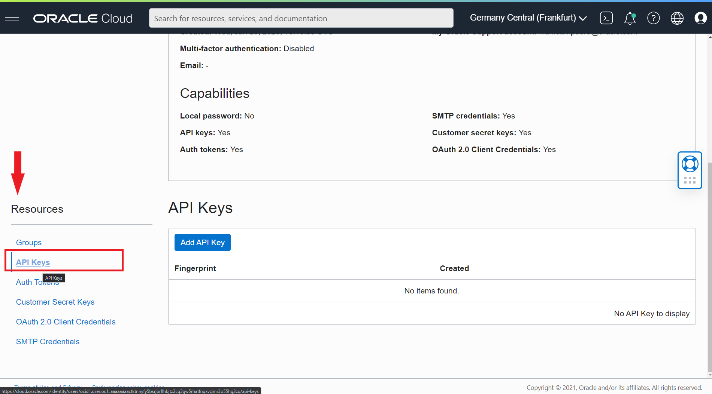
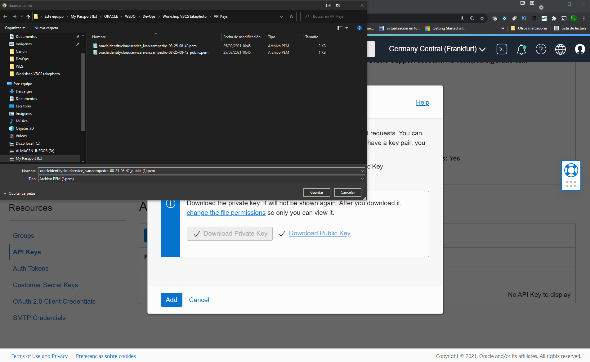

# Visual Builder workshop.
This workshop will teach you how to create a new Oracle Visual Builder mobile application, that will allow you to take a photo with the mobile camera and upload it to Oracle Cloud (OCI) Object Storage.

  
1.- Creating the API Key.

  
## Creating the API Key
You will have to connecto the Visual Builder app to OCI Object Storage Bucket to Store the mobile photo or image files. You must create an API key OCI element to access to the OCI Services via API REST. Let's create the API Key.

First Sign in [OCI web console](https://cloud.oracle.com) with your credentials (Note: this credentials will be provided to you in the workshop by the trainers, or you can use youw own credentials if you have a trial or paid tenancy).

Write your tenancy name and click **Next** Button.

Then click Continue leaving the Identity Providers as *oracleidentitycloudservice*

Next write you *User Name* and *Password* and click in **Connect** Button to access to OCI web console.

Then click in the **Profile icon** at the top right of the console to access to the user **Settings**.

Scroll down and click **API Keys** in the *Resources menu*

Next click **Add API Key** button to add a new API Key.

Select **Generate API Key Pair**. 
Note: you could use your own public and private keys in pem format, but in this workshop and for academical purposes we'll use the auto generathed keys.

Next you must to download the *Private* and *Public* Keys to your laptop/desktop.

After that, you might have two **.pem** files one mark as public.

Then click in **Add** button.

Next window is the summary or **Configuration File Preview**. Click in the **copy** link to copy your OCI API credentials to a text file in you local computer as you will need them in future steps in the workshop. Then click **Close** Button to finish the process.

You might have a new API key created and you should see the Fingerprint key in the OCI web console. 

You can get the Config file that you copied before clicking in the *tree vertical* dots in the Fingerprint row and select **View Config File**.

